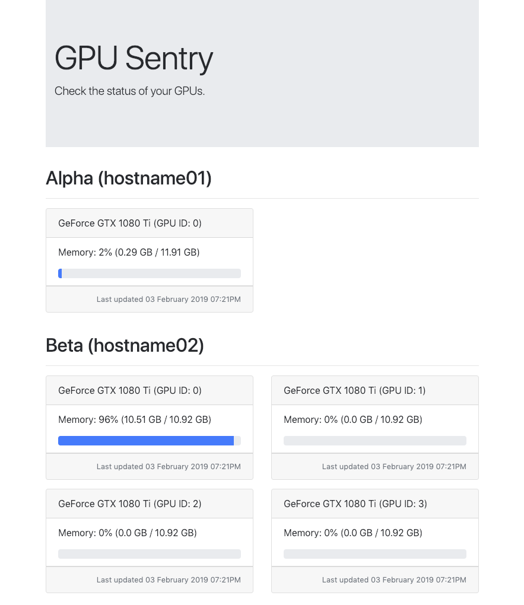

# gpu-sentry
Flask-based package for monitoring utilisation of nVidia GPUs.



## Motivation
Instead of checking each of your machines with `nvidia-smi` command, a client
running on the machines is sending periodically statistics about GPU memory
utilisation. The central server is collecting the requests and displays them on
a single website.

## Configuration
Most of the settings can be found in `client/client_config.py` and `server/server_config.py`.

### Server Config
```
# Server-side configuration.
PERMIT_CLIENTS = {
    # FULL_HOSTNAME is obtained by socket.gethostname()
    "FULL_HOSTNAME": {
        "codename": "KNOWN_AS_NAME",
        "name": "(SYSTEM_NAME)",
    },
}
SERVER_DEBUG = False
SERVER_HOSTNAME = "abc.xyz"
SERVER_PORT = 8000
```

`PERMIT_CLIENTS` has two fold purpose, first the keys are used to filter out
machines which will be displayed on the website, i.e. we permit only machines
with the specified `hostname`s, and the corresponding values point to display
names.

#### Client Config
```
# Client-side configuration.
CLIENT_TIMEOUT = 5 * 60  # in seconds.
SERVER_URL = 'http://abc.xyz:8000/api'
```
`CLIENT_TIMEOUT` allows to set how often a client, i.e. the GPU machine sends
statistics to the central server. You can alter the value with the amount of
seconds you wish to set.

## Running
Currently the package does not work as a background process so please use
`screen`, `tmux` or `wsgi`.

To run the package as client, i.e. on a GPU machine run

```
cd client
python client.py
```

or on the central server execute

```
cd server
python server.py
```
